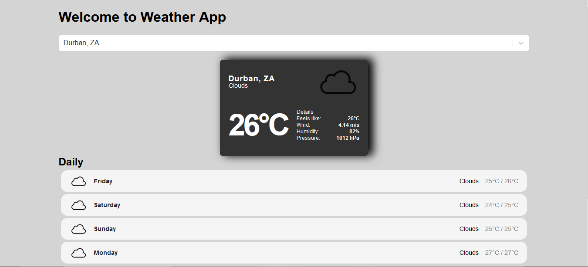

# Project Title

React Weather App

## Demo Link:

Access my site at https://59mrrobot.github.io/weather-app/

## About The App:

I have built a weather app that uses two API, one for the list of cities (https://rapidapi.com/wirefreethought/api/geodb-cities/) and the second for the actual forecasts (https://openweathermap.org/). I was looking for a fun project that I could build in order to showcase my ability to fetch data from APIs and my ability to style components in such a way that they look clean and dynamic.

## Screenshots:

## Technologies:

- React
- Typescript
- HTML
- SCSS
- React Accessible Accordion
- React Select Async Paginate

## Setup:

- Download or clone the repository.
- Install by running `npm install`.
- Start the server by running `npm start`.
- Visit the app at `http://localhost:3000/`.
